# Materials for day 4 of IMPRS-PHDS 2022 course (IDEM187) on Topics in Digital and Computational Demography, 14-18 November 2022

**NOTE**: Please read this document first, before watching videos, or checking other directories.

- **Course description**: [https://www.demogr.mpg.de/en/career_6122/international_advanced_studies_in_demography_6682/courses_6931/topics_in_digital_and_computational_demography_11309](https://www.demogr.mpg.de/en/career_6122/international_advanced_studies_in_demography_6682/courses_6931/topics_in_digital_and_computational_demography_11309)
- **This repository is for**: Day 4, November 17th 2022
- **Topics covered in day 4**: Using large-scale bibliometric data for demographic research; Advantages and pitfalls of using Scopus data to trace internal and international scholarly migration worldwide
- **Instructor**: [Aliakbar Akbaritabar](https://akbaritabar.github.io/) (: [Akbaritabar](https://github.com/akbaritabar) | : [@akbaritabar](https://twitter.com/akbaritabar) | [mastodon.social/@Akbaritabar](https://mastodon.social/@Akbaritabar) | Email: akbaritabar@demogr.mpg.de (please add "IMPRS-PHDS-2022-IDEM187" in the email's subject line))

# Instructor's introduction
Aliakbar Akbaritabar (Ali) is a computational social scientist with a background in sociology. 

He joined the Max Planck Institute for Demographic Research (MPIDR) as a research scientist from the German Centre for Higher Education Research and Science Studies (DZHW) and German Competence Centre for Bibliometrics.

Ali holds a PhD in economic sociology and labor studies from the University of Milan, and a PhD in sociology (social welfare) from the Allameh Tabataba'i University of Tehran. His work focuses on themes related (but not limited) to science of science, scholarly migration, social networks, collaboration networks, and computational social science. He looks forward to collaborate on research ideas close to these themes, using computational tools and techniques to answer social scientific questions. He is @akbaritabar on Twitter ([https://twitter.com/akbaritabar](https://twitter.com/akbaritabar)) or Mastodon ([https://mastodon.social/@Akbaritabar](https://mastodon.social/@Akbaritabar)).

Here ([https://www.demogr.mpg.de/en/news_events_6123/news_press_releases_4630/news/how_to_use_bibliometric_data_for_demographic_research_10784](https://www.demogr.mpg.de/en/news_events_6123/news_press_releases_4630/news/how_to_use_bibliometric_data_for_demographic_research_10784)) you could read more on how we re-purpose bibliometric data to answer social science and demographic questions.

# Outline of the lecture (83 minutes pre-recorded videos)
1. Introduction (23 minutes, [video 1])
    - Welcome and introduction
    - What is bibliometric data?
    - What type of questions can be studied using bibliometric data?
    - What type of demographic questions can be studied using bibliometric data?
    - Limitations and pitfalls of using bibliometric data.
2. Data Science skills to use bibliometric data (34 minutes, [videos: 2_1 (21 minutes), 2_2 (13 minutes)])
    - [video 2_1] Introduction to parallelised analysis of large-scale bibliometric, text and network data (with Dask in Python, DuckDB and DBeaver in SQL)
    - [video 2_2] Hands-on example of parallelised analysis of bibliometric data
    - [video 2_2] Hands-on example on use of text and network analysis
3. Example empirical study using bibliometric data (26 minutes, [video 3])
    - Internal and international migration of scholars worldwide: Trends, patterns, and inter-relationships

# Important setup instructions for participants

0. Please clone or download this repository ([https://github.com/akbaritabar/BiblioDemography_IMPRS_PHDS_2022_IDEM187](https://github.com/akbaritabar/BiblioDemography_IMPRS_PHDS_2022_IDEM187.git)) by clicking on the green button on top right (see photo)

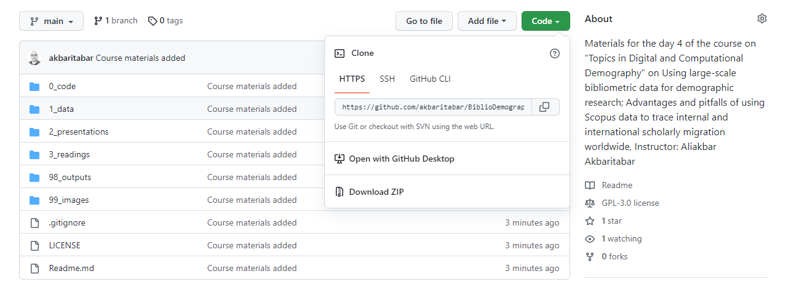

1. Please go over the presentation files in the `2_presentations` directory (and course videos on NextCloud) that in combination with Python and R scripts in `0_code` directory should help you set-up and get started. You can ask your clarification questions on the course forum (please feel free to answer each other's questions, if you have already solved a problem).
2. For `Python` users to replicate the results, you should follow steps outlined in `0_code\01_Required_installation_setup_python.md` to have all necessary libraries installed.
3. For `R` users to replicate the results, you should follow steps outlined in `0_code\02_Required_installation_setup_R.md` to have all necessary libraries installed.

## Reading materials
### Required
- Miranda-González, A., Aref, S., Theile, T., & Zagheni, E. (2020). Scholarly migration within Mexico: Analyzing internal migration among researchers using Scopus longitudinal bibliometric data. EPJ Data Science, 9(1). [https://doi.org/10.1140/epjds/s13688-020-00252-9](https://doi.org/10.1140/epjds/s13688-020-00252-9)

### Highly recommended
- Ganguli, I. (2015). Immigration and Ideas: What Did Russian Scientists “Bring” to the United States? Journal of Labor Economics, 33(S1), S257–S288. [https://doi.org/10.1086/679741](https://doi.org/10.1086/679741)
- Cole, J. R., & Zuckerman, H. (1987). Marriage, Motherhood and Research Performance in Science. Scientific American, 256(2), 119–125. JSTOR. [https://doi.org/10.1038/scientificamerican0287-119](https://doi.org/10.1038/scientificamerican0287-119)

## Course assignments

During this course (and in pre-recorded videos), you have heard about multiple topics (migration of scholars, data science skills such as parallelization, text analysis, and network analysis). The scripts shared used Python, R, and SQL. There are multiple assignments prepared for each topic and language. **You need to choose a minimum of 1 assignment (each bullet point is 1 assignment) based on your background from the list below and do them**.

**What do do?** 

First, choose the language or technology you wish to use (based on your skills and familiarity). Second, choose the topic you wish to work on which is closer to your interests. Solve **minimum 1 assignment** and bring your responses to the live session.

- For **R** users:
    - **Mobility trajectory**: use the two csv files in data directory including an example scholar's mobility history (`example_mobility_trajectory.csv`) and life events (`example_life_events.csv`). 
        1. Visualize these two sources of data in an innovative way (you can get inspiration from presented slides in the video on "Example empirical study using bibliometric data"). 
        2. How many internal and international mobility events have happened? 
        3. Based on these two sources of data (mobility versus life events), could you speculate on potential reasons of mobility?
    - **Network analysis**: use the code in `08_HU_seminar_network_analysis.Rmd` and replicate the toy example in slides 16-19. What was the highest "degree" of a node? (possible answers: 4, 5, 8, 9)
    - **Text analysis**: use the Rmarkdown file linked from Monica's repository, and replicate her analysis. What was the "bigram" with the "second highest" frequency of use in demographic publications?
- For **Python** users:
    - **Mobility trajectory**: use the two csv files in data directory including an example scholar's mobility history (`example_mobility_trajectory.csv`) and life events (`example_life_events.csv`).
        1. Visualize these two sources of data in an innovative way (you can get inspiration from presented slides in the video on "Example empirical study using bibliometric data"). 
        2. How many internal and international mobility events have happened? 
        3. Based on these two sources of data (mobility versus life events), could you speculate on potential reasons of mobility?
    - **Network analysis**: use the code in `09_example_network_igraph_python.py` and replicate the toy example (the two graphs are the same, use one). What was the highest "degree" of a node? (possible answers: 3, 7, 8, 9)
    - **Text analysis**: use script `07_text_analysis_noun_phrase_clauses.py` and replicate the toy examples. How many "noun-phrase-clauses" where found for the 2nd abstract? (remember that Python is a 0-indexed language, so this is "abstract[1]")
    - **Parallelization**: use script `03_parallelization_with_dask_duckdb_dbeaver.md` and replicate the toy example in parallelised analysis of ORCID XML files. How many "distinct" ORCID IDs are present in the provided data?
- For **Excel** (or any other tool that reads CSV files) users:
    - **Mobility trajectory**: use the two csv files in data directory including an example scholar's mobility history (`example_mobility_trajectory.csv`) and life events (`example_life_events.csv`).
        1. Visualize these two sources of data in an innovative way (you can get inspiration from presented slides in the video on "Example empirical study using bibliometric data"). 
        2. How many internal and international mobility events have happened? 
        3. Based on these two sources of data (mobility versus life events), could you speculate on potential reasons of mobility?

- For **SQL** users:
    - **SQL in DuckDB/DBeaver**: use script `04_simple_duckdb_dbeaver_query.sql` and read the output of the parallelization example using DuckDB inside DBeaver (this files are provided in the repository as well, you do not need Python knowledge to reproduce them). How many "distinct" ORCID IDs are present in the provided data?

During the live session (see further below), I will show you the responses to these assignments.

**NOTE**: Most innovative visualizations from the **Mobility trajectory** assignment (regardless of the tool used being R, Python, Excel or others) will be selected and included in the course's public repository with the name of students who contributed them. If you decided to do this assignment, consider saving a high quality image of your visualization.

## Live Q&A and discussion session (3 hours, 14:00-17:00 CET, hybrid format)

We will have a brief discussion (and interactive quiz) on the reading materials. Then we will go over the scripts to solve the assignments together. Follow the instructions to setup one of Python/R/SQL/Excel on your laptop and bring your responses to the assignments.

**NOTE**: Zoom link shared by the PHDS team, please check their email.

## Course's discussion forum
- Link: shared by the PHDS team, please check their email.
- If you have a question on materials and replication, post in "Day 4". Please feel free to answer each other's questions, if you have already solved a problem

## Course evaluation

Evaluation of the course will be through a combination of a final exam (with two multiple choice questions), responses to assignments, and activity during the live session's discussions.

# Student visualizations of the "mobility trajectory" assignment with their names (on alphabetical order)

(Please let me know if there is a mistake in the names, thanks)

**Abdelilah Bouhamidi**

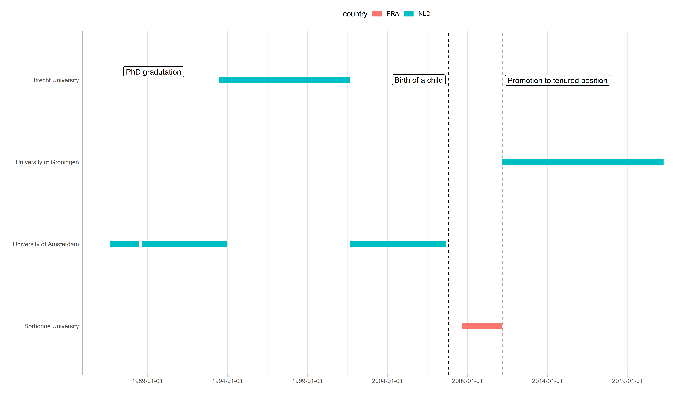

**Anna Bulina**

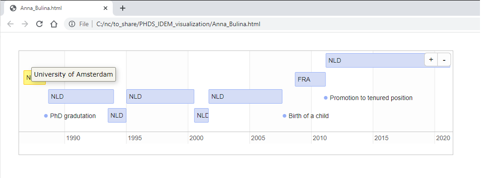

**Edith Darin**

**Egor Kotov**

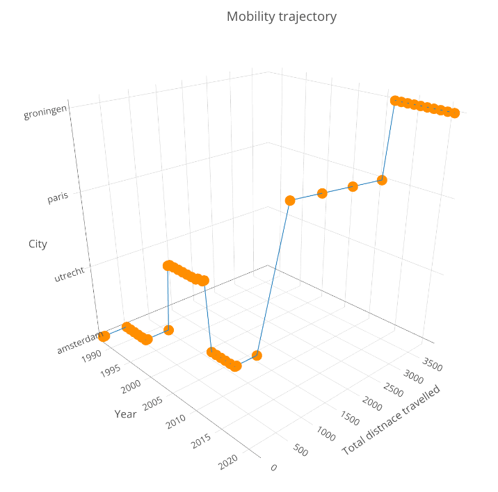

**Hisrael Passarelli**

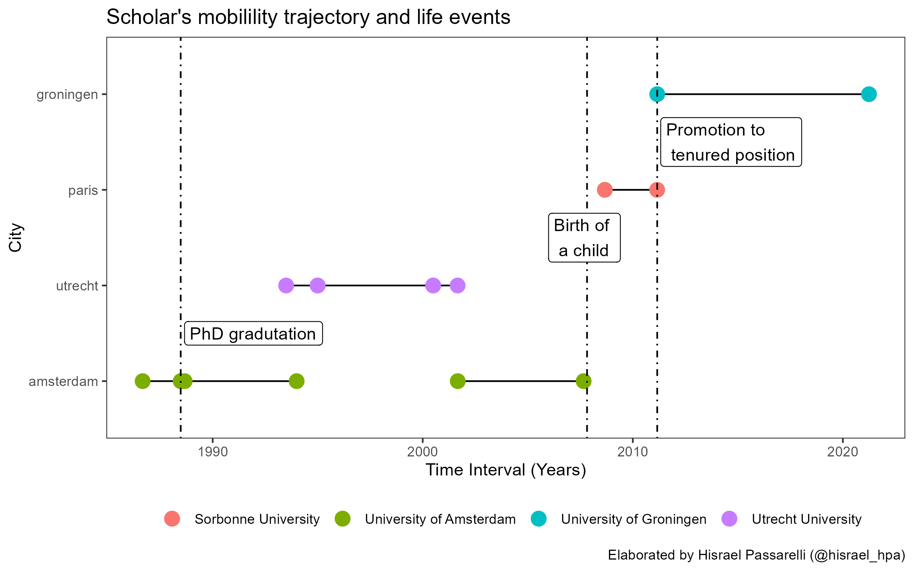

**Luiqing Yang**

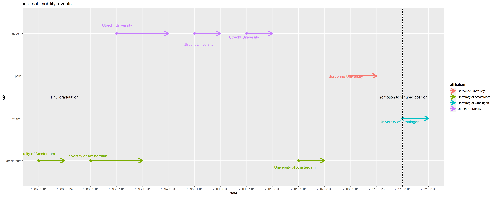

**Luiqing Yang 2**

**Yuan Peng**

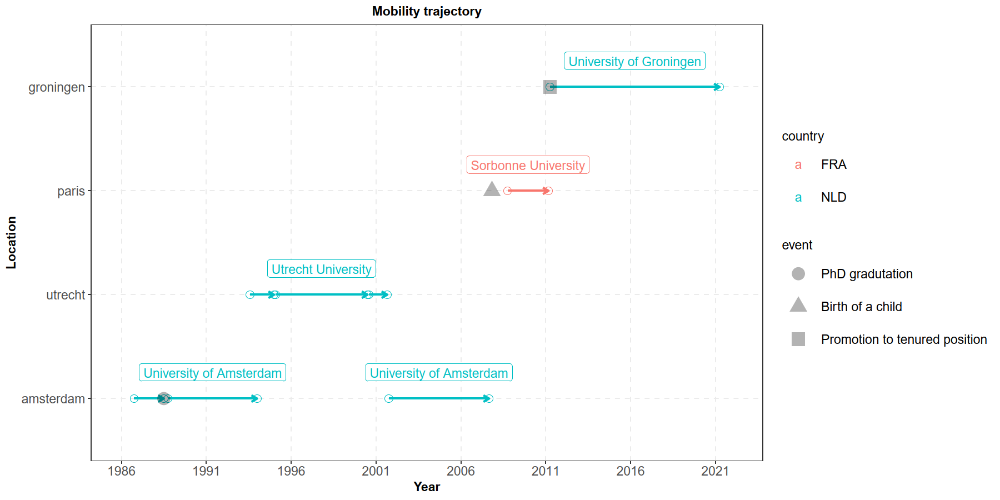

**Pietro Violo**

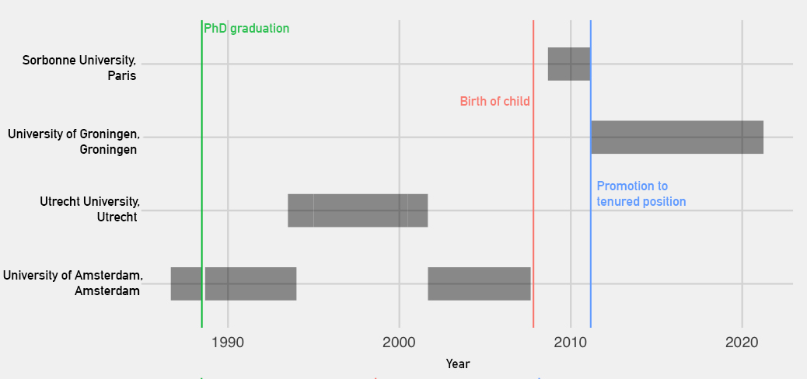

**Sara Ronnkvist**

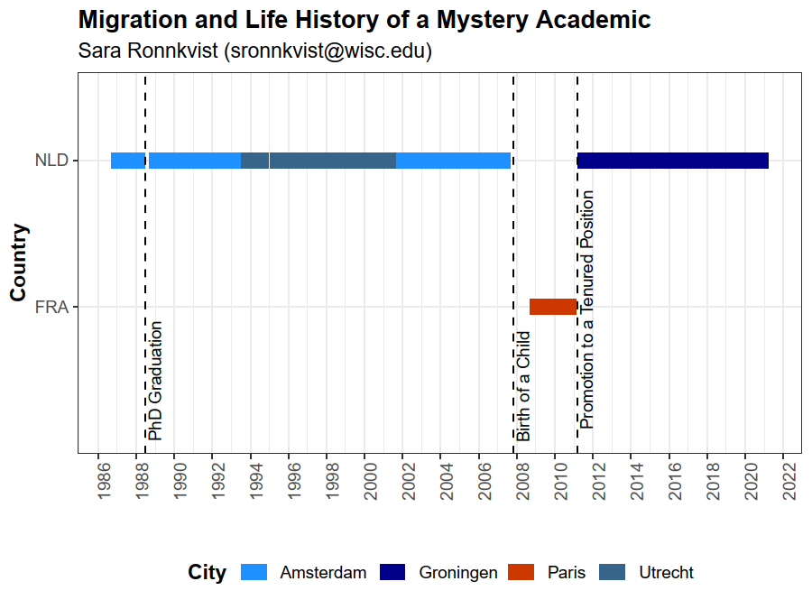

**Thiago Malaguth**

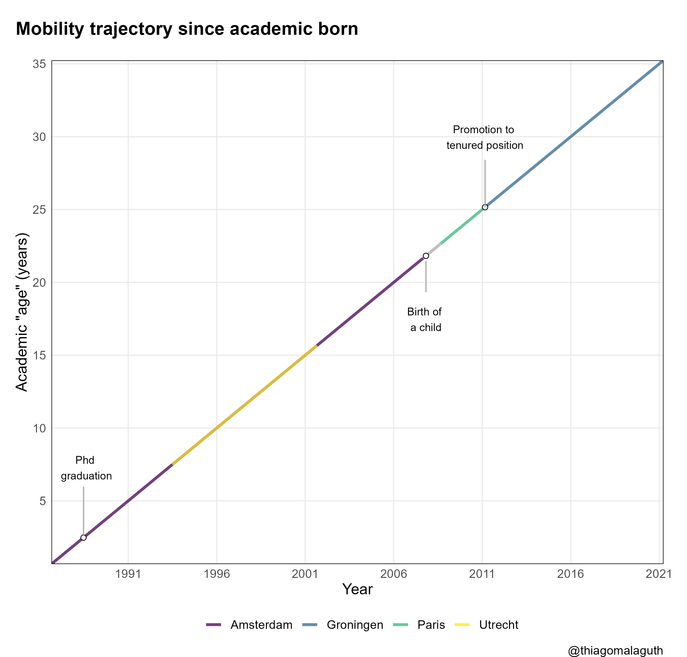

**Vincent Ramos**

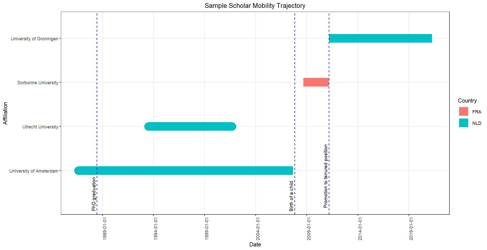

**Yang**

**Yang 2**

